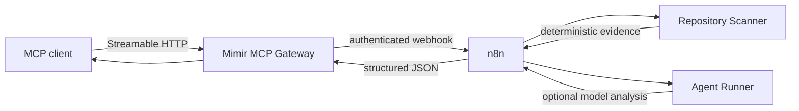

<p align="center">
  
</p>

<p align="center">
  <strong>Self-hosted engineering analysis for MCP clients, orchestrated by n8n.</strong>
</p>

<p align="center">
  Turn recurring work like bug hunts, refactor reviews and implementation planning into reusable tools instead of repeating the same analysis in every chat.
</p>

<p align="center">
  <a href="https://github.com/Nicolas25vlad/mimir-workflows/actions/workflows/ci.yml"></a>
  <a href="LICENSE"></a>
  
  
  
  
</p>

<p align="center">
  <a href="#why-mimir">Why Mimir?</a> ·
  <a href="#architecture">Architecture</a> ·
  <a href="#tools">Tools</a> ·
  <a href="#quick-start">Quick start</a> ·
  <a href="#documentation">Docs</a>
</p>

---

## Why Mimir?

AI coding clients are great at reasoning, but a lot of engineering work is repetitive:

- inspect a repository before planning a change;
- look for bug-prone patterns;
- find high-churn or oversized files;
- identify refactor candidates;
- build an implementation plan from repository context.

Mimir turns those routines into **stable MCP tools**.

The expensive and mechanical work happens in your homelab. The chat client receives a compact structured result and can spend its context reasoning about what matters.

> **Core rule:** deterministic evidence and model interpretation are never silently mixed.

## Architecture



Mimir is intentionally split into four small layers:

| Layer | Responsibility |
| --- | --- |
| **MCP Gateway** | Stable public tool contract, auth and transport |
| **n8n** | Workflow orchestration, retries and composition |
| **Repository Scanner** | Bounded read-only repository evidence |
| **Agent Runner** | Optional provider-neutral LLM analysis |

The scanner and agent runner are internal services. Only the MCP gateway is intended to be exposed outside the Docker network.

## Tools

### `bug_hunt`

Finds deterministic bug, security and debt signals, then optionally asks the configured model for a second-pass analysis.

```json
{
  "repository": "owner/repository",
  "ref": "main",
  "minimum_severity": "medium",
  "focus": ["auth", "error handling"]
}
```

### `refactor_analysis`

Ranks refactor candidates using git churn, file size and deterministic risk signals. Optional model analysis can propose incremental changes.

```json
{
  "repository": "owner/repository",
  "ref": "main",
  "objective": "maintainability",
  "target": "repository"
}
```

### `implementation_plan`

Builds a repository-grounded implementation plan. If no model provider is configured, Mimir still returns a deterministic baseline plan.

```json
{
  "repository": "owner/repository",
  "ref": "main",
  "request": "Add rate limiting to the public API",
  "depth": "deep"
}
```

## What the scanner actually looks at

The scanner currently collects:

- resolved commit SHA for the requested ref;
- bounded file inventory and language distribution;
- recent commit history;
- high-churn files;
- largest analyzed source/config files;
- project entry/config files;
- deterministic findings such as suspicious `eval`, disabled TLS verification, empty catches, shell execution patterns and secret-like literals.

It does **not** run repository code, package installs, tests, hooks or build scripts.

## Agent-assisted mode

The agent runner works with OpenAI-compatible chat completion APIs.

Examples include:

- NVIDIA NIM;
- vLLM;
- OpenAI-compatible Ollama gateways;
- other compatible providers.

Configure:

```dotenv
AGENT_BASE_URL=https://provider.example/v1
AGENT_API_KEY=...
AGENT_MODEL=your-model
```

Leave those variables blank and Mimir runs in **deterministic-only mode**.

If the provider is temporarily unavailable, the deterministic result is still returned with agent error metadata instead of failing the whole workflow.

## Quick start

### Requirements

- Docker with Compose v2
- enough memory to run n8n plus the Mimir services
- optional GitHub token for private repositories
- optional OpenAI-compatible inference endpoint

### 1. Clone and configure

```bash
git clone https://github.com/Nicolas25vlad/mimir-workflows.git
cd mimir-workflows
cp .env.example .env
```

Generate independent secrets:

```bash
openssl rand -hex 32
```

Use different values for:

```text
MCP_AUTH_TOKEN
N8N_WEBHOOK_TOKEN
SCANNER_AUTH_TOKEN
AGENT_AUTH_TOKEN
N8N_ENCRYPTION_KEY
```

### 2. Start the stack

```bash
docker compose up -d --build
```

Check the gateway:

```bash
curl -fsS http://localhost:8787/healthz
```

Expected shape:

```json
{
  "status": "ok",
  "service": "mimir-workflows",
  "version": "0.3.0"
}
```

### 3. Configure n8n credentials

Open n8n at `http://localhost:5678` and create three **Header Auth** credentials:

| Credential | Header | Value |
| --- | --- | --- |
| `Mimir Webhook Auth` | `x-mimir-token` | `N8N_WEBHOOK_TOKEN` |
| `Mimir Scanner Auth` | `x-mimir-internal-token` | `SCANNER_AUTH_TOKEN` |
| `Mimir Agent Auth` | `x-mimir-agent-token` | `AGENT_AUTH_TOKEN` |

### 4. Import the workflows

Import the JSON files under `workflows/`:

```text
bug-hunt.json
refactor-analysis.json
implementation-plan.json
```

Attach the credentials above if n8n cannot resolve the placeholder IDs automatically, then activate the workflows.

### 5. Connect an MCP client

Point the client to:

```text
https://your-mimir-host.example/mcp
```

with:

```http
Authorization: Bearer <MCP_AUTH_TOKEN>
```

The MCP client should handle protocol initialization and tool discovery.

See [docs/MCP.md](docs/MCP.md) for the contract and connection notes.

## Security model

Mimir treats repositories as hostile input.

Some important boundaries:

- arbitrary clone hosts are rejected;
- repository code is never executed by the scanner;
- repository text is treated as untrusted prompt data;
- secret-like evidence is redacted;
- scanner and agent-runner ports are internal-only;
- workers run read-only with dropped Linux capabilities;
- every internal hop uses a separate credential;
- provider failure degrades gracefully instead of corrupting deterministic output.

Read the full threat model in [docs/SECURITY.md](docs/SECURITY.md).

## Project structure

```text
.
├── src/
│   ├── agent/                # provider-neutral LLM worker
│   ├── scanner/              # deterministic repository scanner
│   ├── auth.ts
│   ├── config.ts
│   ├── index.ts              # MCP gateway
│   └── n8n-client.ts
├── workflows/                # importable n8n workflows
├── docs/
│   ├── ARCHITECTURE.md
│   ├── DEPLOYMENT.md
│   ├── MCP.md
│   └── SECURITY.md
├── .github/
├── compose.yml
├── Dockerfile
└── AGENTS.md
```

## Documentation

| Document | What it covers |
| --- | --- |
| [Architecture](docs/ARCHITECTURE.md) | Components, data flow and design boundaries |
| [Deployment](docs/DEPLOYMENT.md) | Homelab, reverse proxy and GitOps deployment |
| [MCP integration](docs/MCP.md) | Endpoint, auth and tool contracts |
| [Security](docs/SECURITY.md) | Threat model and hardening |
| [Workflow internals](workflows/README.md) | n8n credentials and workflow pipeline |
| [Contributing](CONTRIBUTING.md) | Development and contribution workflow |
| [Agent instructions](AGENTS.md) | Guardrails for coding agents working on this repository |

## Development

```bash
npm install
npm run check
docker build -t mimir-workflows:local .
```

For local process development:

```bash
npm run dev
npm run dev:scanner
npm run dev:agent
```

CI validates:

- TypeScript type checking;
- unit tests;
- production build;
- n8n workflow JSON structure;
- Docker image build.

## Status

Mimir is currently an early-stage homelab project. The MCP contracts are intentionally small while the analysis workers mature.

### Next

- [ ] GitHub App installation authentication
- [ ] Semgrep / CodeQL adapters
- [ ] result cache and persistence
- [ ] PR-triggered background analysis
- [ ] OpenTelemetry traces
- [ ] token usage and estimated model-cost metrics

## License

Released under the [MIT License](LICENSE).

Copyright © 2026 Nicolas Vlad.
