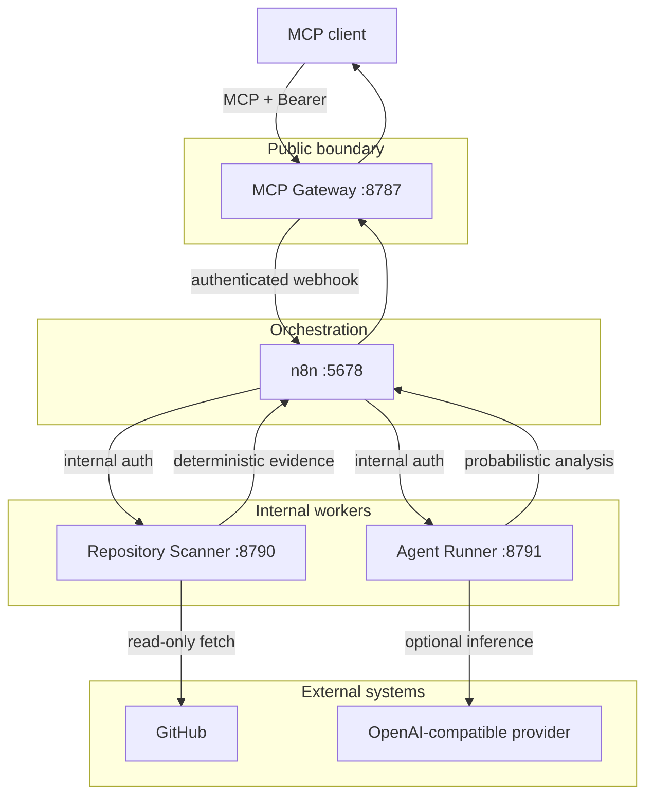
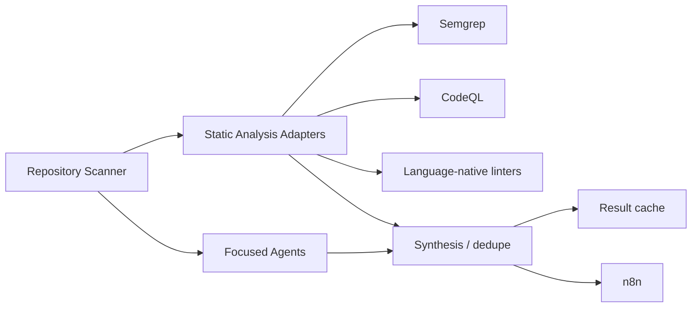

# Architecture

Mimir is built around a simple rule: **the public MCP contract stays small while the internal analysis pipeline can evolve freely**.

## System overview



## Components

### MCP Gateway

Entry point for MCP clients.

Responsibilities:

- expose semantic tools over Streamable HTTP;
- validate tool arguments;
- authenticate clients;
- map public tool calls to internal workflow webhooks;
- enforce request timeouts;
- return bounded structured results.

It should not contain repository scanning logic or large prompt chains.

### n8n

The orchestration layer.

Responsibilities:

- route workflow stages;
- fan work out to internal workers;
- combine deterministic and optional agent results;
- provide operational workflow visibility;
- later support schedules, PR events and recurring automation.

n8n is deliberately not the main code-analysis engine.

### Repository Scanner

A deterministic, read-only worker.

Responsibilities:

- accept GitHub repository identifiers;
- resolve a requested ref to a commit;
- perform shallow ephemeral fetches;
- inventory bounded source/config files;
- calculate recent git churn;
- detect language mix and large files;
- apply explainable first-pass rules;
- redact secret-like evidence;
- delete the checkout after analysis.

The scanner never executes repository code.

### Agent Runner

An optional inference worker.

Responsibilities:

- receive original tool input plus deterministic scan context;
- treat repository content as untrusted prompt data;
- bound serialized model context;
- call an administrator-configured OpenAI-compatible endpoint;
- request structured output when supported;
- normalize provider responses;
- return graceful error metadata if inference fails.

The agent runner never decides whether deterministic scanner evidence is true. The two evidence layers remain separate.

## Public contracts

Current MCP tools:

| Tool | Purpose |
| --- | --- |
| `bug_hunt` | Find likely bugs and security/debt signals |
| `refactor_analysis` | Rank refactor candidates |
| `implementation_plan` | Build a repository-grounded plan |

Public tool names and argument shapes should change slowly.

Internal n8n topology can change without forcing MCP clients to change.

## Data flow

A normal `bug_hunt` call looks like this:

```text
1. MCP client calls bug_hunt
2. Gateway validates arguments
3. Gateway calls the bug-hunt n8n webhook
4. n8n calls repo-scanner
5. scanner fetches repository + builds deterministic context
6. n8n calls agent-runner
7. agent-runner either:
   a. calls the configured provider, or
   b. reports deterministic-only mode
8. n8n shapes one bounded result
9. Gateway returns it to the MCP client
```

## Design decisions

### Deterministic before probabilistic

Static evidence is cheaper, faster and easier to explain.

Models receive a reduced context instead of the entire repository whenever possible.

### Evidence stays labeled

A regex/static rule match and a model suspicion are not the same type of evidence.

Mimir keeps them in separate fields so downstream clients can reason about confidence correctly.

### No generic execution primitive

Mimir intentionally does not expose tools like:

```text
execute_workflow(id, payload)
run_shell(command)
clone(url)
```

Semantic tools create a narrower and more auditable attack surface.

### Workers over giant Code nodes

Heavy logic belongs in typed workers with tests.

n8n should coordinate, retry and compose rather than become an unreadable graph full of embedded application code.

## Future architecture

Likely additions:



Potential workers:

- static-analysis adapters;
- result store/cache;
- GitHub App token broker;
- observability/usage collector.

The MCP boundary should not need to grow at the same rate as these internals.
